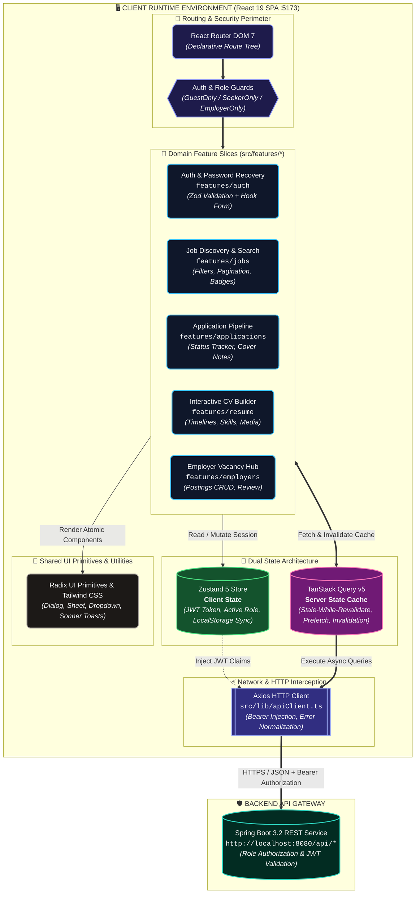

# hrms-frontend — Modern React & TypeScript ATS Single Page Application

A high-performance, modular Single Page Application (SPA) built with **React 19**, **TypeScript**, and **Vite 7** for the Human Resource Management System (HRMS). It delivers dedicated workflows for **Job Seekers** (exploring vacancies, tracking applications, building interactive CVs with skill/experience timelines) and **Employers** (publishing job advertisements, managing listings, and reviewing candidate pipelines).

This repository is the **frontend client**. The companion Spring Boot backend API is located in [HRMS](https://github.com/kamiltuncok/HRMS).

---

## Recruiter & Engineering Summary

- **Primary Stack**: React 19, TypeScript 5.9, Vite 7, Tailwind CSS, Radix UI / shadcn primitives, Zustand 5, TanStack Query v5, React Hook Form, Zod, React Router DOM 7, Axios, Framer Motion.
- **Key Engineering Highlights**: Feature-sliced folder architecture (`src/features/*`), strict end-to-end type safety with TypeScript & Zod schema validation, unified server-state caching and synchronization via TanStack Query, persisted client session management via Zustand, centralized Axios HTTP interception (JWT injection and standardized error/response unwrapping), accessible headless UI components with Radix UI.
- **Primary Technical Challenge**: Building an interactive, multi-step resume builder and applicant tracking dashboard with complex nested form validations, real-time client-side feedback, and robust asynchronous cache invalidation against a role-based REST API.

---

## System Architecture & Data Flow



---

## Key Features & UI Workflows

### 1. Job Seeker Experience & Career Hub
- **Dynamic Job Search & Multi-Filters**: Instant keyword search combined with filtering by City, Job Title, Employment Type (Full-time, Part-time, Remote), and Category.
- **Job Posting Detail & Application Submission**: Deep-linkable posting pages detailing job requirements, salary ranges, company information, and one-click application submission.
- **Application Status Dashboard**: Real-time tracking of submitted applications with status badges (Applied, Under Review, Accepted, Rejected).
- **Interactive Résumé Builder**: Comprehensive profile editor supporting:
  - Educational history with ongoing/graduation status.
  - Work experience timeline with company, role, and date ranges.
  - Programming languages and technical skill badges.
  - Foreign language proficiency levels (CEFR 1–5 scale).
  - Social media / portfolio integration (GitHub, LinkedIn).
  - Profile photo and document uploads.

### 2. Employer & Hiring Management Portal
- **Job Advertisement Publishing**: Form with validation for publishing new listings, defining city locations, employment types, salary bounds, and application deadlines.
- **Listing Management**: Real-time listing status toggling (Active / Passive) and vacancy overview.
- **Applicant Pipeline Review**: Inspection of candidates' resumes, contact information, and cover letters.

### 3. Authentication, Security & Session Handling
- **Role-Segmented Authentication**: Discrete login and registration flows for Job Seekers and Corporate Employers.
- **End-to-End Password Recovery Flow**: Request password reset link via email, token verification on landing, and secure password updating.
- **Session Persistence & Route Guards**: User token and role claims stored securely with Zustand, driving route protection guards across public, candidate, and employer routes.

---

## Technology Stack

| Category | Technologies |
|---|---|
| **Core & Framework** | React 19.2, TypeScript 5.9, Vite 7.3 |
| **Routing & Navigation** | React Router DOM 7.13 |
| **State Management** | Zustand 5.0 (Client & Session), TanStack Query v5.90 (Server Cache) |
| **Forms & Validation** | React Hook Form 7.71, Zod 4.3, `@hookform/resolvers` |
| **UI Components & Styling** | Tailwind CSS 3.4, Radix UI Primitives, Lucide React, Sonner (Toasts) |
| **Animation** | Framer Motion 12.35 |
| **HTTP & Networking** | Axios 1.13 |
| **Code Quality & Linting** | ESLint 9, TypeScript ESLint |

---

## Project Structure

The project adheres to a **Feature-Based / Domain-Driven** folder structure:

```
hrms-frontend/
├── public/                       # Static public assets
├── src/
│   ├── app/                      # Application root configuration
│   │   ├── App.tsx               # Root component with Providers (QueryClient, Toaster)
│   │   └── router.tsx            # Route tree and role-based Route Guards
│   ├── components/ui/            # Reusable atomic UI components (Radix + Tailwind)
│   │   ├── button.tsx, dialog.tsx, dropdown-menu.tsx, input.tsx, select.tsx, tabs.tsx
│   ├── features/                 # Domain feature slices
│   │   ├── auth/                 # Login, Register, ForgotPassword, ResetPassword
│   │   ├── jobs/                 # JobList, JobDetail, JobFilter, PostJobForm
│   │   ├── applications/         # JobApplicationList, ApplicationCard
│   │   ├── resume/               # ResumeView, EducationForm, ExperienceForm, SkillForm
│   │   └── employers/            # EmployerProfile, EmployerJobList
│   ├── hooks/                    # Reusable custom React hooks
│   ├── lib/                      # Infrastructure libraries & utilities
│   │   ├── apiClient.ts          # Axios instance with interceptors & error handlers
│   │   └── utils.ts              # Class merging (`clsx`, `tailwind-merge`)
│   ├── stores/                   # Global Zustand client stores (authStore.ts)
│   ├── types/                    # Domain TypeScript interfaces & API contracts
│   ├── index.css                 # Global CSS tokens & Tailwind directives
│   └── main.tsx                  # Application bootstrap entry point
├── package.json                  # Dependencies and build scripts
├── tsconfig.json                 # TypeScript compiler configuration
└── vite.config.ts                # Vite build and plugin setup
```

---

## Getting Started

### Prerequisites

- [Node.js](https://nodejs.org/) (v18.x or v20.x recommended)
- [HRMS Spring Boot Backend](https://github.com/kamiltuncok/HRMS) running on `http://localhost:8080`

### 1. Configuration Setup

Create an environment configuration file `.env` in the project root (see `.env.example`):

```bash
# .env
VITE_API_URL=http://localhost:8080
```

### 2. Install Dependencies

```bash
npm install
```

### 3. Start Development Server

```bash
npm run dev
```

The Vite dev server initializes on **`http://localhost:5173`**.

### 4. Build for Production

```bash
# Type-check and build production bundle
npm run build

# Preview production build locally
npm run preview
```

---

## Frontend Engineering Decisions & Best Practices

1. **Server-State vs Client-State Separation**:
   - *Architecture*: Application state is strictly separated into **Server State** (handled by TanStack Query) and **Client/Session State** (handled by Zustand). TanStack Query handles caching, deduplication, background re-fetching, and optimistic updates, keeping the global Zustand store lean and focused exclusively on authentication tokens and active user identity.
2. **Schema-Driven Form Validation with Zod & React Hook Form**:
   - *Reliability*: Forms are validated against strictly typed Zod schemas. This ensures that frontend validation rules match backend constraints exactly, preventing unnecessary roundtrips for malformed requests.
3. **Centralized HTTP Client & Interceptors**:
   - *Maintainability*: `src/lib/apiClient.ts` automatically attaches `Authorization: Bearer <token>` headers to outgoing requests and unwraps the Spring Boot `DataResult<T>` structure, ensuring UI components interact directly with pure typed data models.

---

## Known Limitations & Roadmap

- **End-to-End Testing**: Implementation of Cypress or Playwright test suites for critical paths (user registration, job application submission, resume creation).
- **Internationalization (i18n)**: Adding multilingual support (e.g. English / Turkish) using `react-i18next`.
- **Server-Side Rendering / Static Optimization**: Exploring Next.js or Remix for public job board SEO ranking if search engine discoverability is required.
