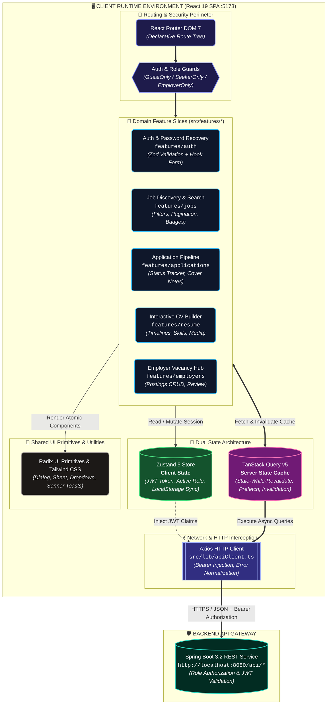

# hrms-frontend — Modern React 19 & TypeScript ATS Single Page Application

<div align="center">


**A high-performance, modular Single Page Application (SPA) for the Human Resource Management & Applicant Tracking System (HRMS).**

[Live Client (Local)](#getting-started--local-setup) • [Architecture Guide](#system-architecture--data-flow) • [Feature Slices](#key-features--ui-workflows) • [Backend API Service](https://github.com/kamiltuncok/HRMS)

</div>

---

> ### 📋 GitHub Repository Metadata
> * **Description:** Modern React 19 & TypeScript ATS frontend featuring TanStack Query v5, Zustand, Radix UI, Zod validation, and feature-sliced architecture.
> * **Topics:** `react-19`, `typescript`, `vite`, `tanstack-query`, `zustand`, `tailwind-css`, `radix-ui`, `applicant-tracking-system`, `spa`, `zod`

---

## 📖 Executive Summary & Core Value

`hrms-frontend` is a responsive, accessibility-first web client engineered for enterprise recruitment workflows. It delivers tailored, role-governed experiences:
* **Job Seekers:** Real-time multi-filter job search (by city, job title, employment mode, category), interactive multi-step résumé builder with visual timelines, and a live application status dashboard.
* **Corporate Employers:** Vacancy management hub, job advertisement publisher with validation, and an applicant review workspace with candidate CV inspection.

The application leverages **React 19**, **TypeScript 5.9**, and **Vite 7**, establishing a clear separation between client state (Zustand) and server state (TanStack Query), end-to-end type safety, and centralized HTTP interceptors.

---

## 🎯 Evaluator Guide: Key Architectural Highlights

If you are an evaluator or technical recruiter reviewing code quality, here are the best starting points:

| Evaluated Concept | Key Implementation Files | Key Takeaway |
|---|---|---|
| **Feature-Sliced Architecture** | `src/features/` (`auth/`, `jobs/`, `applications/`, `resume/`, `employers/`) | Clean domain separation where each feature slice encapsulates its own components, hooks, and types. |
| **Dual State Architecture** | [`authStore.ts`](file:///c:/Users/MONSTER/OneDrive/Belgeler/GitHub/hrms-frontend/src/stores/authStore.ts) & TanStack Query hooks | Clear split: **Client State** (Zustand for JWT token and session) vs **Server State** (TanStack Query for caching, prefetching, and cache invalidation). |
| **Schema-Driven Form Validation** | `src/features/auth/` & `src/features/jobs/` | **Zod** schema contracts combined with **React Hook Form** for zero-roundtrip form validation. |
| **Centralized HTTP Interceptor** | [`apiClient.ts`](file:///c:/Users/MONSTER/OneDrive/Belgeler/GitHub/hrms-frontend/src/lib/apiClient.ts) | Axios request/response interceptor automatically attaching Bearer tokens and unwrapping Spring Boot `DataResult<T>` envelopes. |
| **Accessible Headless UI** | `src/components/ui/` | Primitive components built with **Radix UI** and styled with **Tailwind CSS** and **class-variance-authority**. |

---

## 🏛️ System Architecture & Data Flow



---

## 🗂️ Project Structure & Directory Organization

```
hrms-frontend/
├── public/                       # Static public assets, favicon, robots.txt
├── src/
│   ├── app/                      # Application root configuration
│   │   ├── App.tsx               # Root component with Providers (QueryClient, Toaster)
│   │   └── router.tsx            # Route tree and role-based Route Guards
│   ├── components/
│   │   ├── layout/               # Header, Navigation, Footer, Container components
│   │   └── ui/                   # Reusable Radix UI & Tailwind design tokens
│   │       ├── button.tsx, dialog.tsx, dropdown-menu.tsx, input.tsx, select.tsx, tabs.tsx
│   ├── features/                 # Feature-Sliced Domain Modules
│   │   ├── auth/                 # Login, Register, ForgotPassword, ResetPassword forms
│   │   ├── jobs/                 # JobList, JobDetail, JobFilter, PostJobForm
│   │   ├── applications/         # JobApplicationList, ApplicationCard, StatusBadge
│   │   ├── resume/               # ResumeView, EducationForm, ExperienceForm, SkillForm
│   │   └── employers/            # EmployerProfile, EmployerJobList, CandidateReview
│   ├── hooks/                    # Reusable custom React hooks
│   ├── lib/                      # Infrastructure libraries & utilities
│   │   ├── apiClient.ts          # Axios instance with interceptors & error handlers
│   │   └── utils.ts              # Class merging utilities (`clsx`, `tailwind-merge`)
│   ├── stores/                   # Global Zustand client stores (authStore.ts)
│   ├── types/                    # Domain TypeScript interfaces & API contracts
│   ├── index.css                 # Global CSS tokens & Tailwind directives
│   └── main.tsx                  # Application bootstrap entry point
├── package.json                  # Dependencies and build scripts
├── tsconfig.json                 # TypeScript compiler configuration
└── vite.config.ts                # Vite build and plugin setup
```

---

## ⚡ Key Features & UI Workflows

### 1. Job Seeker Experience & Career Hub
* **Dynamic Job Search & Multi-Filters:** Instant keyword search combined with filtering by City, Job Title, Employment Type (Full-time, Part-time, Remote), and Category.
* **Job Posting Detail & Application Submission:** Deep-linkable posting pages detailing job requirements, salary ranges, company information, and one-click application submission.
* **Application Status Dashboard:** Real-time tracking of submitted applications with status badges (`Applied`, `Under Review`, `Accepted`, `Rejected`).
* **Interactive Résumé Builder:** Comprehensive profile editor supporting:
  * Educational history with ongoing/graduation status.
  * Work experience timeline with company, role, and date ranges.
  * Programming languages and technical skill badges.
  * Foreign language proficiency levels (CEFR 1–5 scale).
  * Social media / portfolio integration (GitHub, LinkedIn).
  * Profile photo and document uploads.

### 2. Employer & Hiring Management Portal
* **Job Advertisement Publishing:** Form with validation for publishing new listings, defining city locations, employment types, salary bounds, and application deadlines.
* **Listing Management:** Real-time listing status toggling (`Active` / `Passive`) and vacancy overview.
* **Applicant Pipeline Review:** Inspection of candidates' resumes, contact information, and cover letters.

### 3. Authentication, Security & Session Handling
* **Role-Segmented Authentication:** Discrete login and registration flows for Job Seekers and Corporate Employers.
* **End-to-End Password Recovery Flow:** Request password reset link via email, token verification on landing, and secure password updating.
* **Session Persistence & Route Guards:** User token and role claims stored securely with Zustand, driving route protection guards across public, candidate, and employer routes.

---

## 🛠️ Technology Stack

| Domain | Technology |
|---|---|
| **Core & Framework** | React 19.2, TypeScript 5.9, Vite 7.3 |
| **Routing & Navigation** | React Router DOM 7.13 |
| **State Management** | Zustand 5.0 (Client/Session), TanStack Query v5.90 (Server Cache) |
| **Forms & Validation** | React Hook Form 7.71, Zod 4.3, `@hookform/resolvers` |
| **UI Components & Styling** | Tailwind CSS 3.4, Radix UI Primitives, Lucide React, Sonner (Toasts) |
| **Animation** | Framer Motion 12.35 |
| **HTTP & Networking** | Axios 1.13 |
| **Code Quality & Linting** | ESLint 9, TypeScript ESLint |

---

## 🚀 Getting Started & Local Setup

### Prerequisites
* **Node.js:** v18.x or v20.x+
* **Package Manager:** npm (v9+) or pnpm
* **Backend API:** [HRMS Spring Boot Backend](https://github.com/kamiltuncok/HRMS) running on `http://localhost:8080`

### 1. Installation
```bash
# Clone the repository
git clone https://github.com/kamiltuncok/hrms-frontend.git
cd hrms-frontend

# Install dependencies
npm install
```

### 2. Environment Configuration
Create a `.env` file in the project root (see `.env.example`):
```bash
# .env
VITE_API_URL=http://localhost:8080
```

### 3. Start Development Server
```bash
npm run dev
```
The Vite development server will start at **`http://localhost:5173`**.

### 4. Build for Production
```bash
# Type check and build production bundle
npm run build

# Preview production build locally
npm run preview
```

---

## 📐 Engineering Decisions & Trade-offs

1. **Server-State vs Client-State Separation:**
   * *Decision:* State is strictly partitioned. **TanStack Query** manages server data (caching, deduplication, optimistic updates, background invalidation). **Zustand** manages lightweight client session state (JWT, active user info).
   * *Benefit:* Eliminates redundant global state stores and boilerplate Redux reducers.
2. **Schema-Driven Form Validation with Zod:**
   * *Decision:* Forms use Zod schemas linked to React Hook Form via `@hookform/resolvers`.
   * *Benefit:* Guarantees compile-time and runtime type alignment with backend validation rules.
3. **Centralized HTTP Interceptor:**
   * *Decision:* Single Axios instance in `src/lib/apiClient.ts` that handles Bearer token attachment and transparently extracts payload data from Spring Boot `DataResult<T>` envelopes.
